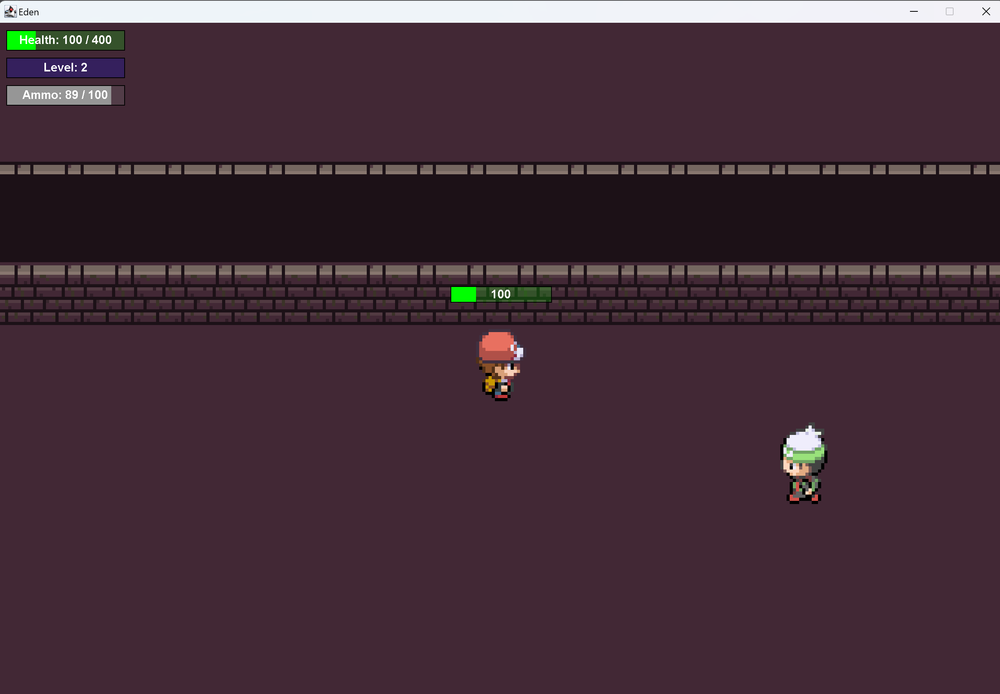

# Eden
ist ein 2D-Dungeon Spiel. Es sollten die grundlegenden Spielelemente, d.h. Spielerbewegung, Kollisionserkennung, aber auch grafische Elemente wie bspw. Animationen oder grafische Oberflächen implementiert werden.

Hier gibt es einen screenshot eines aktuellen Spielstands

  

